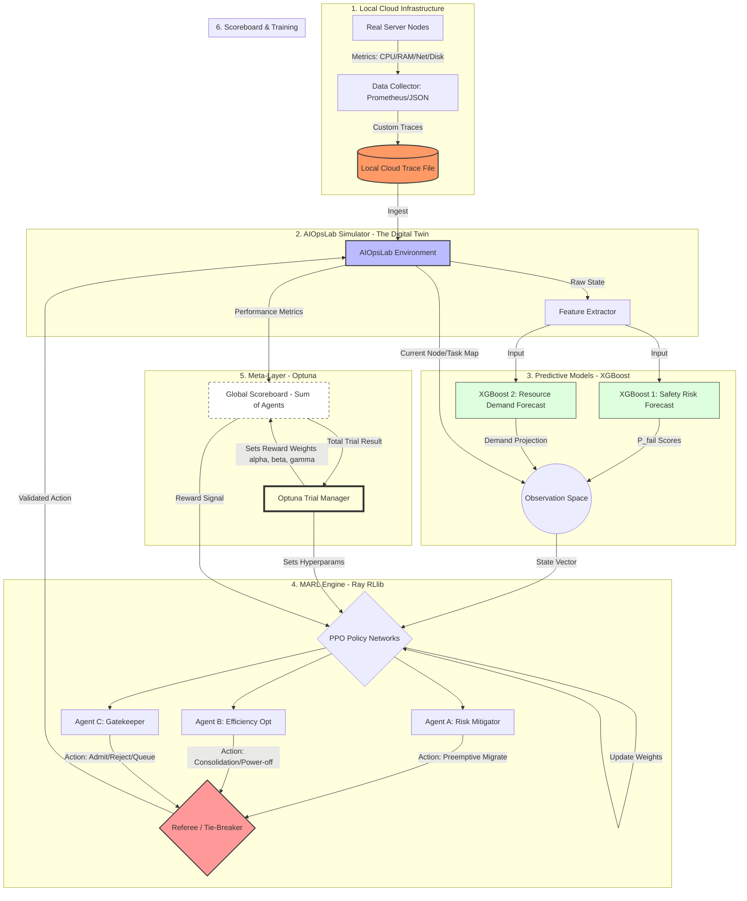

# Full Orchestrator Architecture

[Visualize in IDE: architecture.mmd](architecture.mmd)

```mermaid
graph TD
    %% Layer 1: Data Source
    subgraph Local_Cloud_Source [1. Local Cloud Infrastructure]
        RealNodes[Real Server Nodes] -->|Metrics: CPU/RAM/Net/Disk| Prom[Data Collector: Prometheus/JSON]
        Prom -->|Custom Traces| TraceFile[(Local Cloud Trace File)]
    end

    %% Layer 2: Simulator (The Gym)
    subgraph Simulator_Layer [2. AIOpsLab Simulator - The Digital Twin]
        TraceFile -->|Ingest| AIOps[AIOpsLab Environment]
        AIOps -->|Raw State| Feat[Feature Extractor]
    end

    %% Layer 3: The Brains (Predictive Analysis)
    subgraph Brain_Layer [3. Predictive Models - XGBoost]
        Feat -->|Input| XGB1[XGBoost 1: Safety Risk Forecast]
        Feat -->|Input| XGB2[XGBoost 2: Resource Demand Forecast]
        XGB1 -->|P_fail Scores| Obs((Observation Space))
        XGB2 -->|Demand Projection| Obs
        AIOps -->|Current Node/Task Map| Obs
    end

    %% Layer 4: The Agents (The Drivers)
    subgraph Agent_Layer [4. MARL Engine - Ray RLlib]
        Obs -->|State Vector| PolicyNet{PPO Policy Networks}

        PolicyNet --> AgentA[Agent A: Risk Mitigator]
        PolicyNet --> AgentB[Agent B: Efficiency Opt]
        PolicyNet --> AgentC[Agent C: Gatekeeper]

        AgentA -->|Action: Preemptive Migrate| Ref{Referee / Tie-Breaker}
        AgentB -->|Action: Consolidation/Power-off| Ref
        AgentC -->|Action: Admit/Reject/Queue| Ref

        Ref -->|Validated Action| AIOps
    end

    %% Layer 5: The Optimizer (The Supervisor)
    subgraph Meta_Optimizer [5. Meta-Layer - Optuna]
        Opt[Optuna Trial Manager] -->|Sets Hyperparams| PolicyNet
        Opt -->|Sets Reward Weights alpha, beta, gamma| Score
    end

    %% Layer 6: Reward & Learning Loop
    subgraph Feedback_Loop [6. Scoreboard & Training]
        AIOps -->|Performance Metrics| Score[Global Scoreboard - Sum of Agents]
        Score -->|Reward Signal| PolicyNet
        PolicyNet -->|Update Weights| PolicyNet
        Score -->|Total Trial Result| Opt
    end

    %% Styling
    style TraceFile fill:#f96,stroke:#333,stroke-width:2px
    style AIOps fill:#bbf,stroke:#333,stroke-width:2px
    style XGB1 fill:#dfd,stroke:#333
    style XGB2 fill:#dfd,stroke:#333
    style Opt fill:#ffd,stroke:#333,stroke-width:4px
    style Ref fill:#f99,stroke:#333,stroke-width:2px
    style Score fill:#fff,stroke:#333,stroke-dasharray: 5 5
```
