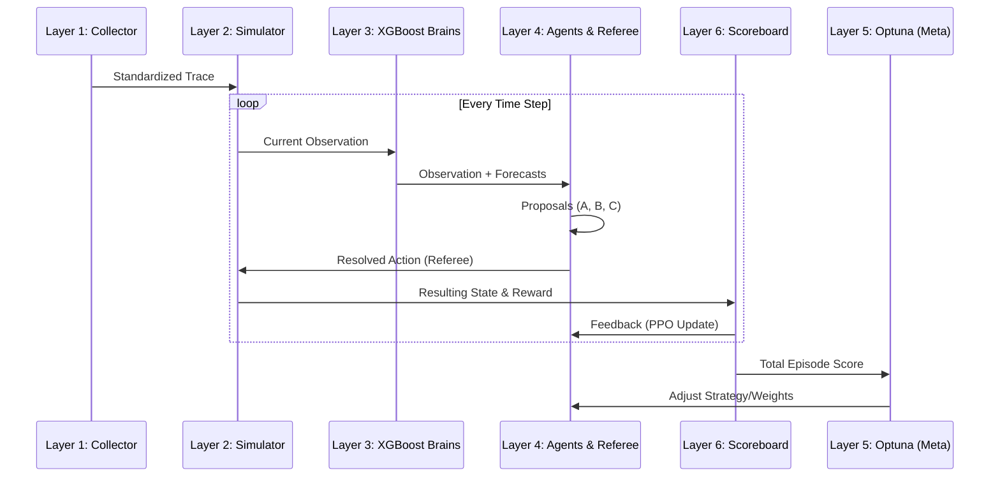

# Borg Orchestrator: Multi-Agent System Architecture

This document provides a refined technical explanation of the 6-layer autonomous orchestrator stack. The system is designed to manage complex cloud infrastructure by balancing three competing objectives: **Safety (Risk Mitigator)**, **Efficiency (Energy Optimizer)**, and **Availability (Admission Control)**.

---

## 1. The 6-Layer Decision Pipeline

The orchestrator operates as a continuous closed-loop system. Each "step" in the environment flows through these layers:

### Layer 1: Data Ingestion (The Senses)
The process begins at the edge. Real-time metrics from Prometheus or JSON-based telemetry are ingested.
- **Validation:** Incoming data is checked for schema drift (missing CPU/RAM metrics) and timestamp consistency.
- **Normalization:** Raw hardware metrics are converted into standardized "Trace Rows" that the simulator can understand.

### Layer 2: Digital Twin Simulator (The Sandbox)
We do not experiment on live production clusters. Instead, Layer 1 data is loaded into the **AIOpsLab Simulator**.
- **State Management:** The simulator tracks every node's resource usage and every task's health.
- **Determinism:** It allows us to replay historical "incident traces" to see how different agent policies would have performed.

### Layer 3: Predictive Brains (The Foresight)
Before agents act, the system looks into the future using **XGBoost** models:
- **Safety Risk Forecast:** Predicts the probability of a node failure ($P_{fail}$) within the next window.
- **Resource Demand Projection:** Estimates upcoming spikes in CPU/RAM requirements.
- **Result:** These scores are injected into the agents' "Observation Space," giving them foresight rather than just hindsight.

### Layer 4: Multi-Agent Policy & Referee (The Drivers)
This is the core of the MAS (Multi-Agent System). Three specialized agents propose actions:
- **Agent A (Risk Mitigator):** Proposes preemptive migrations if a node's $P_{fail}$ is high.
- **Agent B (Efficiency Optimizer):** Proposes powering down underutilized nodes or consolidating tasks.
- **Agent C (Gatekeeper):** Manages the admission queue to prevent cluster saturation.
- **The Referee:** Conflicts (e.g., Agent A wanting to move a task while Agent B wants to sleep the target node) are resolved here using a deterministic safety-first precedence logic.

### Layer 5: Meta-Optimization (The Supervisor)
Not all objectives are equal. Layer 5 uses **Optuna** to tune the "Importance Weights" ($\alpha, \beta, \gamma$) of the agents.
- **Hyperparameter Tuning:** It runs hundreds of simulated "trials" to find the perfect balance that maximizes the Global Score without compromising safety.
- **Reporting:** Every tuning session generates a timestamped report in `reports/` for human auditing.

### Layer 6: Global Scoreboard (The Feedback)
The result of every action is measured:
- **Rewards:** Agents are rewarded for successful migrations and penalized for task deaths or energy waste.
- **Learning Loop:** These rewards are fed back into the **Ray RLlib PPO** (Proximal Policy Optimization) engine to improve the agents' decision-making over time.

---

## 2. Technical Flow Summary

---

## 3. Operational Mandates

- **Isolation:** Each track (Orchestrator, XGBoost, Autonomy) is strictly isolated to prevent dependency bleeding.
- **Momentum:** The system is designed for autonomous execution. Once configured, the `full-process` command executes the entire 6-layer lifecycle without human intervention.
- **Transparency:** Every critical decision, from schema validation to Optuna tuning, is logged and reported in KST-timestamped markdown artifacts.
